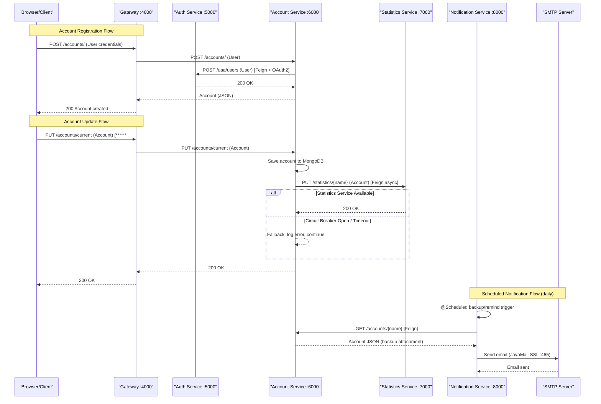

# API & Service Communication Contracts

PiggyMetrics exposes 10 REST API endpoints across 4 business services, all routed through a single Zuul API gateway, with inter-service communication handled exclusively via synchronous Feign clients (plus two asynchronous scheduled notification flows).

## Service Catalog

| Service | Port | Category | Purpose |
|---|---|---|---|
| gateway | 4000 (ext: 80) | API Layer | Netflix Zuul API gateway; routes all external traffic to business services |
| auth-service | 5000 | Business | OAuth2 authorization server; manages user credentials and token issuance |
| account-service | 6000 | Business | Core domain service managing user accounts, incomes, expenses, and savings |
| statistics-service | 7000 | Business | Stores normalized financial time-series data points per account |
| notification-service | 8000 | Business | Manages notification preferences; sends scheduled reminder and backup emails |
| config | N/A (internal) | Infrastructure | Spring Cloud Config Server; serves centralized configuration to all services |
| registry | 8761 | Infrastructure | Netflix Eureka Server; service registration and discovery |
| monitoring | 9000 | Observability | Hystrix Dashboard; visualizes circuit breaker metrics |
| turbine-stream-service | 8989 | Observability | Aggregates Hystrix metrics streams from RabbitMQ for the dashboard |

## API Endpoints Inventory

| Service | Method | Path (with context) | Request Type | Response Type | Notes |
|---|---|---|---|---|---|
| auth-service | GET | /uaa/users/current | Principal (from token) | Principal (JSON) | Returns current authenticated user |
| auth-service | POST | /uaa/users | User (JSON body) | 200 OK | Requires scope=server; creates new user |
| account-service | GET | /accounts/current | Principal (from token) | Account (JSON) | Returns current user account |
| account-service | PUT | /accounts/current | Account (JSON body) | 200 OK | Saves changes to current user account |
| account-service | POST | /accounts/ | User (JSON body) | Account (JSON) | Creates new account (and auth user) |
| account-service | GET | /accounts/{name} | Path param | Account (JSON) | Requires scope=server or name=demo |
| statistics-service | GET | /statistics/current | Principal (from token) | List of DataPoint (JSON) | Returns current user statistics |
| statistics-service | GET | /statistics/{accountName} | Path param | List of DataPoint (JSON) | Requires scope=server or name=demo |
| statistics-service | PUT | /statistics/{accountName} | Account (JSON body) | 200 OK | Requires scope=server; called by account-service |
| notification-service | GET | /notifications/recipients/current | Principal (from token) | Recipient (JSON) | Returns current user notification settings |
| notification-service | PUT | /notifications/recipients/current | Recipient (JSON body) | Recipient (JSON) | Updates current user notification settings |

## Management & Observability Endpoints

| Service | Endpoint | Notes |
|---|---|---|
| account-service | /actuator/health, /actuator/info, /actuator/metrics | Spring Boot Actuator (default endpoints) |
| statistics-service | /actuator/health, /actuator/info, /actuator/metrics | Spring Boot Actuator (default endpoints) |
| notification-service | /actuator/health, /actuator/info, /actuator/metrics | Spring Boot Actuator (default endpoints) |
| monitoring | /hystrix (port 9000) | Hystrix Dashboard UI |
| turbine-stream-service | /turbine.stream (port 8989) | Turbine aggregated Hystrix metrics stream |
| registry | /eureka (port 8761) | Eureka dashboard and service registry |

No custom `@Timed` or Micrometer metric registrations were detected in the source code.

## DTOs & Contracts

**Service-level domain entities used as API contracts:**

- `User` — request body for `POST /accounts/` and `POST /uaa/users`; carries username and password for account creation
- `Account` (account-service) — full account response/request body; contains incomes, expenses, saving, and note; used as response for GET and request body for PUT
- `Account` (statistics-service) — incoming DTO for `PUT /statistics/{accountName}`; structurally similar to account-service's Account but owned by the statistics domain
- `DataPoint` — response element in the statistics list endpoints; represents a normalized time-series snapshot
- `Recipient` — request/response DTO for notification preferences endpoints; contains email and notification frequency settings
- `Principal` — standard Java security Principal; returned by `GET /uaa/users/current`

No OpenAPI/Swagger specifications, `.proto` files, or GraphQL schemas were found. No Springdoc or Springfox annotations are present. Serialization uses Spring Boot's default Jackson configuration (no custom `ObjectMapper` or serializer overrides detected). DTOs are standard POJOs (no Lombok `@Value` or Java records — not immutable).

## Communication Patterns

**Synchronous (Feign + Eureka):**
All inter-service calls use Spring Cloud OpenFeign with Eureka-based service discovery (services register by logical name). Three Feign clients are defined:
- `AuthServiceClient` (in account-service) → `POST /uaa/users` on auth-service; no fallback
- `StatisticsServiceClient` (in account-service) → `PUT /statistics/{accountName}` on statistics-service; fallback `StatisticsServiceClientFallback` logs the error and silently drops the update
- `AccountServiceClient` (in notification-service) → `GET /accounts/{accountName}` on account-service; no fallback

Feign Hystrix integration is enabled (`feign.hystrix.enabled: true`). The global Hystrix timeout is 10 000 ms (account-service/notification-service/statistics-service shared config). The gateway has a higher timeout: `hystrix.command.default.execution.isolation.thread.timeoutInMilliseconds: 20000`. Ribbon read/connect timeouts on the gateway are both 20 000 ms.

**Asynchronous (Scheduled):**
Notification-service runs two `@Scheduled` jobs via Spring cron:
- Backup notification: daily at noon (`0 0 12 * * *`) — fetches account data via Feign then sends email
- Reminder notification: daily at midnight (`0 0 0 * * *`) — sends email without upstream call

Both jobs dispatch email sending via `CompletableFuture.runAsync()` (fire-and-forget thread pool). Errors are logged but not retried.

**Message Broker (Spring Cloud Bus):**
RabbitMQ is used exclusively for Spring Cloud Bus (configuration refresh broadcasts) and Hystrix metrics streaming to Turbine. It is not used for business event messaging.

**API Gateway:**
Netflix Zuul routes external requests at port 80 → 4000 to backend services by path prefix. The gateway does not perform response aggregation or composition — it is a pure proxy. Each route forwards to a single backend service. The gateway registers with Eureka as a client but routes to `statistics-service`, `notification-service`, and `account-service` by logical Eureka name, while auth-service is routed by hardcoded URL (`http://auth-service:5000`).

**Security posture:**
All business service endpoints are protected by OAuth2 resource server validation (`@EnableResourceServer`). Tokens are validated by calling `GET /uaa/users/current` on auth-service (introspection via `CustomUserInfoTokenServices`). Fine-grained authorization uses `@PreAuthorize` with `#oauth2.hasScope('server')` for server-to-server calls. The demo account path (`/accounts/demo`, `/statistics/demo`) is accessible with user-level tokens. The root path (`/`) and `/demo` in account-service are publicly accessible. No TLS is configured at the application layer; TLS termination is expected at the infrastructure layer (not present in docker-compose). The Auth Service issues JWT-like tokens via Spring Security OAuth2 with a symmetric key (configured in `OAuth2AuthorizationConfig`).

**Startup dependency chain:**
Services depend on the Config service being healthy before starting (enforced in `docker-compose.yml` via `condition: service_healthy`). Config service must start before Registry, which must start before all business services and the Gateway.

## Service Technology Matrix

| Service | Web Framework | Data Access | Discovery | Gateway | Actuator | Cache | Metrics Export |
|---|---|---|---|---|---|---|---|
| gateway | Spring MVC + Zuul | None | Eureka Client | Yes (Zuul) | No | None | None |
| auth-service | Spring MVC | Spring Data MongoDB | Eureka Client | No | No | None | None |
| account-service | Spring MVC | Spring Data MongoDB | Eureka Client | No | Yes | None | Hystrix Stream |
| statistics-service | Spring MVC | Spring Data MongoDB | Eureka Client | No | Yes | In-memory (Guava) | Hystrix Stream |
| notification-service | Spring MVC | Spring Data MongoDB | Eureka Client | No | Yes | None | Hystrix Stream |
| config | Spring MVC | None (filesystem/git) | None | No | No | None | None |
| registry | Eureka Server | None | Eureka Server | No | No | None | None |
| monitoring | Spring MVC | None | Eureka Client | No | No | None | None |
| turbine-stream-service | Spring MVC | None | Eureka Client | No | No | None | None |

## Service Communication Sequence

