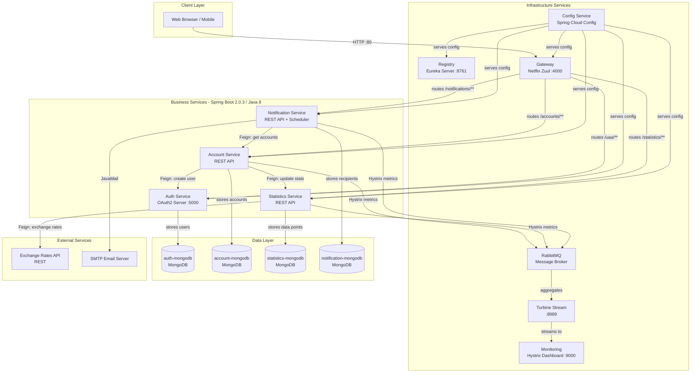
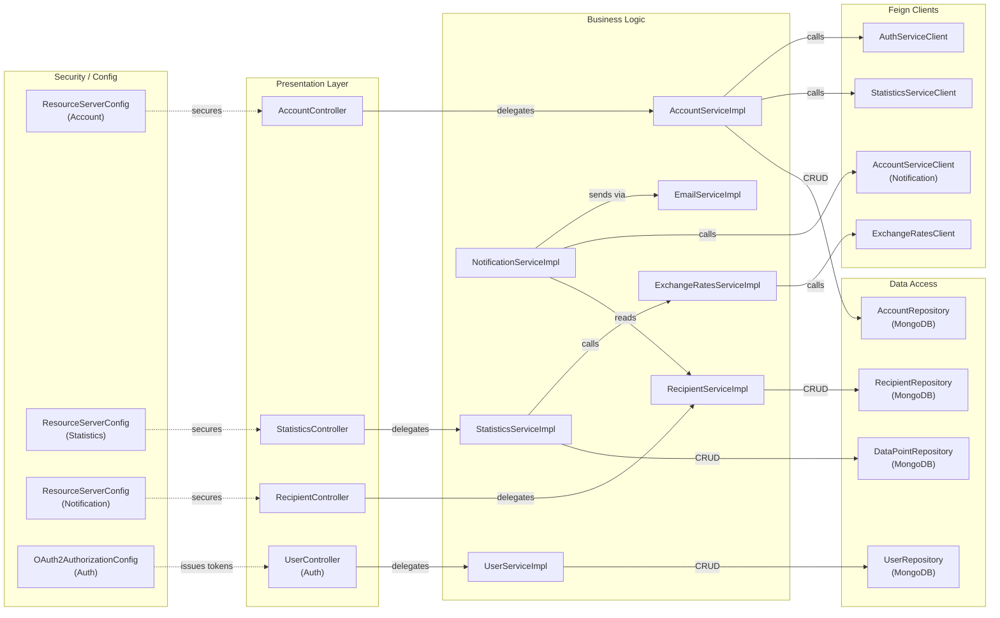

# Architecture Diagram

PiggyMetrics is a Spring Cloud microservices application for personal finance management, composed of multiple independently deployable services coordinated via Eureka service discovery, a Zuul API gateway, a centralized Spring Cloud Config server, and RabbitMQ as the message broker.

## Application Architecture

### Technology Stack Summary

| Layer | Technology | Version | Purpose |
|---|---|---|---|
| API Gateway | Netflix Zuul | Spring Cloud Finchley | Route external requests to microservices |
| Service Discovery | Netflix Eureka | Spring Cloud Finchley | Service registration and discovery |
| Configuration | Spring Cloud Config | Finchley.RELEASE | Centralized configuration management |
| Security | Spring Security OAuth2 | Spring Cloud Finchley | OAuth2 authorization server and resource servers |
| Business Logic | Spring Boot | 2.0.3.RELEASE | REST microservices framework |
| Data Access | Spring Data MongoDB | Spring Boot 2.0.3 | MongoDB repositories per service |
| Messaging | Spring Cloud Bus / AMQP | Finchley.RELEASE | Config refresh broadcast via RabbitMQ |
| Circuit Breaker | Netflix Hystrix | Spring Cloud Finchley | Fault tolerance with fallbacks |
| Service Calls | Spring Cloud OpenFeign | Finchley.RELEASE | Declarative HTTP client between services |
| Distributed Tracing | Spring Cloud Sleuth | Finchley.RELEASE | Trace IDs across service calls |
| Monitoring | Hystrix Dashboard + Turbine | Spring Cloud Finchley | Circuit breaker metrics aggregation |
| Runtime | Java | 8 | JVM runtime |
| Containerization | Docker / Docker Compose | 2.1 | Container orchestration |

### Data Storage & External Services

Each business service owns a dedicated MongoDB instance (auth-mongodb, account-mongodb, statistics-mongodb, notification-mongodb), following the Database-per-Service pattern. All MongoDB instances use a shared Docker image (`sqshq/piggymetrics-mongodb`) with password-protected access. RabbitMQ serves as the message broker for Spring Cloud Bus (configuration refresh events) and Hystrix metrics streams aggregated by the Turbine Stream service. The Statistics Service consumes an external Exchange Rates REST API to normalize financial data into a common currency. The Notification Service uses JavaMail to send scheduled email notifications via an external SMTP server.

### Key Architectural Decisions

- **Database-per-Service pattern**: Each microservice has its own dedicated MongoDB instance, ensuring loose coupling and independent scaling of data stores.
- **Centralized configuration via Spring Cloud Config**: All service configurations are stored in the `config` module's `shared/` resources and served at startup, enabling environment-specific overrides without redeployment.
- **Circuit breaker pattern with Hystrix**: Inter-service Feign clients are wrapped with Hystrix for fault tolerance; fallback implementations (e.g., `StatisticsServiceClientFallback`) prevent cascading failures.

## Component Relationships

### Component Inventory

| Component | Layer | Type | Responsibility |
|---|---|---|---|
| AccountController | Presentation | REST Controller | Handle account CRUD and current user account endpoints |
| StatisticsController | Presentation | REST Controller | Handle statistics data point retrieval and update |
| RecipientController | Presentation | REST Controller | Handle notification settings retrieval and update |
| UserController | Presentation | REST Controller | Handle user registration (Auth Service) |
| AccountServiceImpl | Business Logic | Service | Create accounts, save changes, normalize with statistics |
| StatisticsServiceImpl | Business Logic | Service | Update and retrieve statistical data points |
| ExchangeRatesServiceImpl | Business Logic | Service | Fetch and cache currency exchange rates |
| NotificationServiceImpl | Business Logic | Service | Scheduled notification dispatch using Feign + email |
| RecipientServiceImpl | Business Logic | Service | Manage notification recipient settings |
| UserServiceImpl | Business Logic | Service | Register and manage OAuth2 users |
| EmailServiceImpl | Business Logic | Service | Send email notifications via JavaMail |
| AccountRepository | Data Access | MongoDB Repository | Persist and query Account documents |
| DataPointRepository | Data Access | MongoDB Repository | Persist and query statistical DataPoint documents |
| RecipientRepository | Data Access | MongoDB Repository | Persist and query Recipient documents |
| UserRepository | Data Access | MongoDB Repository | Persist and query User documents |
| AuthServiceClient | Feign Client | HTTP Client | Create users in Auth Service from Account Service |
| StatisticsServiceClient | Feign Client | HTTP Client | Push account updates to Statistics Service |
| AccountServiceClient | Feign Client | HTTP Client | Fetch account data from Notification Service |
| ExchangeRatesClient | Feign Client | HTTP Client | Retrieve exchange rates from external API |
| ResourceServerConfig (x3) | Infrastructure | Security Config | Configure OAuth2 resource server rules per service |
| OAuth2AuthorizationConfig | Infrastructure | Security Config | Configure OAuth2 authorization server in Auth Service |
