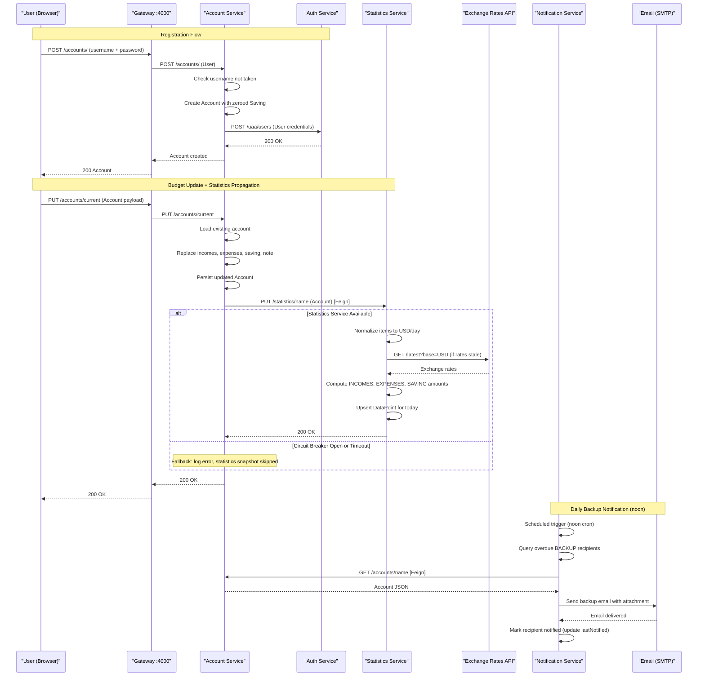

# Core Business Workflows

PiggyMetrics is a personal finance management application that allows users to track incomes, expenses, and savings goals, view normalized financial statistics over time, and receive scheduled email reminders and account backup notifications.

## Domain Entities

| Entity | Service / Bounded Context | Description | Key Relationships |
|---|---|---|---|
| Account | Account Management | Central aggregate representing a user's financial profile including incomes, expenses, and savings plan | Contains a list of income Items, a list of expense Items, and one Saving; identified by username |
| Item | Account Management | A single income or expense line item with a title, amount, currency, time period, and icon | Embedded subdocument of Account; many Items per Account |
| Saving | Account Management | Savings goal state: current saved amount, currency, interest rate, deposit and capitalization flags | Embedded in Account; one Saving per Account |
| User | Identity / Auth | OAuth2 principal representing a registered user; used for authentication and token issuance | Created alongside an Account; stored in auth-service's own MongoDB |
| DataPoint | Statistics | A daily snapshot of a user's financial state normalized to USD/day; represents one point on the time-series chart | Identified by composite key (accountName + date); contains normalized income and expense metrics plus currency exchange rates |
| ItemMetric | Statistics | Normalized representation of an income or expense item (USD base, daily period) within a DataPoint | Embedded in DataPoint; derived from Account's Item list |
| Recipient | Notification | A user's notification preferences: email address and scheduled notification settings (backup and remind) | Identified by accountName; contains a map of NotificationSettings keyed by NotificationType |
| NotificationSettings | Notification | Per-notification-type settings: active flag, frequency (weekly/monthly/quarterly), and last-notified date | Embedded in Recipient as a Map value |

## Service-to-Domain Mapping

| Service | Domain Context | Owned Entities | External Dependencies |
|---|---|---|---|
| account-service | Account Management | Account, Item (embedded), Saving (embedded) | auth-service (create user via Feign), statistics-service (push snapshot via Feign) |
| auth-service | Identity & Access | User (OAuth2 credentials) | None (source of truth for authentication) |
| statistics-service | Financial Statistics | DataPoint, ItemMetric (embedded), DataPointId | External Exchange Rates API (Feign, for currency normalization) |
| notification-service | Notification Management | Recipient, NotificationSettings (embedded) | account-service (fetch account JSON for backup attachment via Feign) |

## Primary Workflows

### Workflow 1: User Registration and Account Creation

A new user registers by submitting credentials to the gateway. The account-service atomically creates an account record in its MongoDB and then calls auth-service to register the OAuth2 user. No rollback mechanism exists: if auth-service user creation fails after the Account is already saved, the two databases become inconsistent.

**Steps:**
1. Client sends `POST /accounts/` with `User` credentials (username + password) via the gateway
2. gateway routes to account-service
3. account-service validates that the username is not already taken (`repository.findByName` must return null)
4. account-service persists a new `Account` document with zeroed-out Saving (USD, 0 amount, 0 interest, no deposit, no capitalization)
5. account-service calls auth-service `POST /uaa/users` via Feign (using client-credentials OAuth2 token) to register the OAuth2 principal
6. account-service returns the newly created Account

### Workflow 2: Account Update with Statistics Propagation

When a user saves budget changes, account-service persists the update and then asynchronously pushes a normalized snapshot to statistics-service. If statistics-service is unavailable, the account update still succeeds (circuit breaker fallback silently drops the statistics update).

**Steps:**
1. Authenticated user sends `PUT /accounts/current` with the updated Account payload
2. gateway routes to account-service
3. account-service loads the existing Account by username; fails if not found
4. account-service replaces the incomes, expenses, saving, and note fields; updates `lastSeen` timestamp
5. account-service persists the updated Account to MongoDB
6. account-service calls statistics-service `PUT /statistics/{name}` via Feign with the updated Account
   - If statistics-service responds: DataPoint is created/updated (see Workflow 3)
   - If Hystrix circuit breaker is open or timeout (10 s) exceeded: `StatisticsServiceClientFallback` logs the error; the account update succeeds regardless

### Workflow 3: Financial Statistics Snapshot Creation

Triggered by an account-service push, statistics-service normalizes income and expense items to a common currency (USD) and a common time period (daily), then persists or replaces the DataPoint for the current day.

**Steps:**
1. statistics-service receives `PUT /statistics/{accountName}` with an Account payload
2. statistics-service fetches current exchange rates (USD/EUR/RUB) from the in-memory cache; if stale (date differs from today), fetches from external Exchange Rates API
3. For each income and expense Item, normalizes amount: convert to USD using exchange rate, then divide by `TimePeriod.getBaseRatio()` to reduce to a daily figure
4. Computes three aggregate `StatisticMetric` values: `INCOMES_AMOUNT`, `EXPENSES_AMOUNT`, `SAVING_AMOUNT` (saving also converted to USD)
5. Creates a `DataPoint` with `DataPointId(accountName, today)` — this upserts the day's snapshot (one DataPoint per account per calendar day)
6. Persists to MongoDB `datapoints` collection and returns

### Workflow 4: Scheduled Notification Dispatch

Two cron-triggered workflows run daily in notification-service to remind users who have not logged in recently (REMIND) or to send them an account data backup by email (BACKUP).

**Remind notifications (daily midnight):**
1. `@Scheduled` triggers `sendRemindNotifications()`
2. Queries MongoDB for all `Recipient` records where REMIND notification is active and `lastNotified` is older than the recipient's configured frequency (weekly/monthly/quarterly) — using a MongoDB `$where` server-side JavaScript query
3. For each qualifying recipient, sends a reminder email via JavaMail (SSL, port 465) asynchronously using `CompletableFuture.runAsync()`
4. On success: marks recipient as notified (updates `lastNotified` to now)
5. On error: logs the error; no retry; recipient's `lastNotified` is not updated (will be retried next scheduled run)

**Backup notifications (daily noon):**
1. `@Scheduled` triggers `sendBackupNotifications()`
2. Queries MongoDB for all `Recipient` records where BACKUP notification is due (same frequency logic as REMIND)
3. For each qualifying recipient, fetches the account JSON via `AccountServiceClient.getAccount(accountName)` (Feign call to account-service)
4. Sends email with account JSON attached as `backup.json` asynchronously
5. On success: marks recipient as notified
6. On error: logs the error; no retry

### Workflow 5: Notification Preferences Management

A user can opt-in to email notifications and configure their frequency at any time.

**Steps:**
1. Authenticated user sends `PUT /notifications/recipients/current` with a `Recipient` payload (email, notification types active/inactive, frequency)
2. notification-service sets `accountName` from the JWT principal
3. For any `NotificationSettings` entry where `lastNotified` is null (newly activated), sets `lastNotified` to the current date — ensuring the next notification fires after the configured frequency rather than immediately
4. Persists the `Recipient` document and returns it

## Cross-Service Data Flows

**Account → Statistics (push on save):**
When an account is updated, account-service pushes the entire Account payload to statistics-service via a synchronous Feign PUT call. statistics-service is the only consumer of this data and derives its own normalized domain model (ItemMetric, DataPoint) from it. Account-service does not read statistics data. If the statistics-service call fails (circuit breaker open, timeout), account-service logs the error via `StatisticsServiceClientFallback` and continues — the account is saved but the statistics snapshot for that day may be missing or stale.

**Account ← Notification (pull for backup):**
The notification-service backup job calls account-service's `GET /accounts/{accountName}` endpoint for each recipient due for a backup notification and uses the returned JSON directly as the email attachment. There is no fallback: if account-service is unavailable, the `CompletableFuture` catches the Throwable and logs it; that recipient's backup email is skipped for that day (no retry). The `lastNotified` timestamp is not updated, so the next scheduled run will attempt again.

**Account → Auth (create user on registration):**
During account creation, account-service calls auth-service's `POST /uaa/users` via Feign to register the new OAuth2 principal. There is no fallback or compensating transaction: if the auth-service call fails after the account document has been persisted, the Account exists in account-mongodb without a matching User in auth-mongodb, leaving the user unable to authenticate. This is a known consistency gap.

## Business Workflow Sequence

## Business Rules & Decision Logic

**Validation Rules:**

- `Account.name`: must not be null; must be unique across all accounts (enforced in application layer via `findByName` check before save)
- `Account.note`: maximum 20 000 characters (`@Length(max=20000)`)
- `Item.title`: 1–20 characters; not null
- `Item.amount`: not null; positive `BigDecimal`
- `Item.currency`: must be one of `USD`, `EUR`, `RUB`; not null
- `Item.period`: must be one of `YEAR`, `QUARTER`, `MONTH`, `DAY`, `HOUR`; not null
- `User.username`: 3–20 characters; not null
- `User.password`: 6–40 characters; not null
- `Recipient.email`: valid email format (`@Email`); not null
- `NotificationSettings.active`: not null; `NotificationSettings.frequency`: must resolve to one of `WEEKLY(7)`, `MONTHLY(30)`, `QUARTERLY(90)` days

**Decision Logic:**

- **Statistics normalization**: Each Item amount is converted from its declared currency to USD using the daily exchange rate, then divided by the time period's base ratio (normalization to a daily figure). Saving amount is converted to USD for the `SAVING_AMOUNT` metric.
- **Exchange rate staleness check**: Exchange rates are considered stale if `container.getDate()` differs from `LocalDate.now()`. A stale cache triggers a Feign call to the external API; fresh rates are served from the in-memory field (single JVM, not distributed).
- **DataPoint upsert by date**: Each account gets at most one DataPoint per calendar day. Saving with the same `DataPointId(accountName, today)` overwrites the previous snapshot (MongoDB document replace).
- **Notification eligibility**: A `Recipient` is eligible for notification if `active = true` AND `lastNotified < now - frequencyInDays`. Evaluated by MongoDB server-side JavaScript in `$where` clauses.
- **Notification frequency**: Three values — `WEEKLY` (7 days), `MONTHLY` (30 days), `QUARTERLY` (90 days). The `Frequency.withDays(int)` factory method enforces that only these three discrete values are accepted.

**State Transitions:**

- **Account**: Created (zeroed Saving, no items) → Updated (any number of income/expense items + Saving changes); no deletion workflow. `lastSeen` is updated on every save.
- **Recipient**: Created on first notification settings save; `lastNotified` is initialized to now for any newly activated notification type (preventing immediate first-run notification). Subsequently updated after each successful email dispatch.

**Constraints:**

- Account username is the MongoDB `@Id` — uniqueness is enforced by MongoDB's primary key constraint; duplicate registration is checked at the application layer before insert.
- OAuth2 tokens are stored in-memory in auth-service; all active sessions are invalidated if auth-service restarts.
- OAuth2 client secrets for service-to-service communication (`account-service`, `statistics-service`, `notification-service`) are stored using `NoOpPasswordEncoder` — compared as plain text, not hashed.

**Transactions:**

- No `@Transactional` annotations are used in any service. MongoDB operations are single-document and inherently atomic within each service. Cross-service operations (account save + statistics update, account create + user create) are not wrapped in any distributed transaction or saga — failures result in partial state without automatic compensation.

**Error Handling:**

- `StatisticsServiceClientFallback`: silently logs the error when statistics-service is unavailable; no retry, no dead-letter queue.
- Notification errors: caught via `CompletableFuture` exception handling; logged only; no retry queue.
- Account creation without auth user: no compensating delete of the Account document if the auth-service Feign call fails.

**Authorization:**

- `GET /accounts/{name}` and `GET /statistics/{accountName}`: require `oauth2.scope=server` OR the path variable equals `'demo'` (demo account accessible to all authenticated users). Enforced with `@PreAuthorize`.
- `PUT /statistics/{accountName}`: requires `oauth2.scope=server` (server-to-server only). Enforced with `@PreAuthorize`.
- `POST /uaa/users`: requires `oauth2.scope=server` (called only by account-service using client credentials). Enforced with `@PreAuthorize`.
- All other authenticated endpoints: require a valid user-level OAuth2 token; `Principal` is extracted from the security context.
