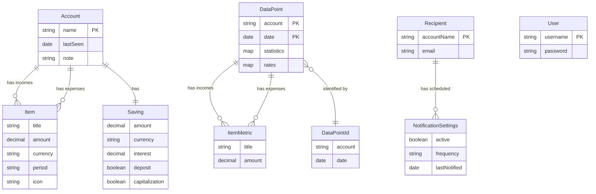

# Data Architecture & Persistence Layer

PiggyMetrics uses Spring Data MongoDB as the ORM framework across all four business services, each with its own dedicated MongoDB instance storing 5 primary document collections: `accounts`, `datapoints`, `recipients`, `users`, and OAuth2 token store.

## Database Configuration

| Service | DB Type | Profile | Connection | Migration Tool | Schema Management |
|---|---|---|---|---|---|
| account-service | MongoDB | all | account-mongodb:27017, db: piggymetrics | None | No migration tool; MongoDB is schema-less |
| auth-service | MongoDB | all | auth-mongodb:27017, db: piggymetrics | None | No migration tool; MongoDB is schema-less |
| statistics-service | MongoDB | all | statistics-mongodb:27017, db: piggymetrics | None | No migration tool; MongoDB is schema-less |
| notification-service | MongoDB | all | notification-mongodb:27017, db: piggymetrics | None | No migration tool; MongoDB is schema-less |
| account-service (test) | Embedded MongoDB (flapdoodle) | test | In-memory | None | Schema-less; seed via `account-service-dump.js` |
| auth-service (test) | Embedded MongoDB (flapdoodle) | test | In-memory | None | Schema-less |
| statistics-service (test) | Embedded MongoDB (flapdoodle) | test | In-memory | None | Schema-less |
| notification-service (test) | Embedded MongoDB (flapdoodle) | test | In-memory | None | Schema-less |

No Flyway, Liquibase, or any other migration tool is configured. Schema evolution is handled implicitly by MongoDB's schema-less nature. The `account-service-dump.js` seed file is loaded into `account-mongodb` at container startup via the Docker image entrypoint.

## Data Ownership per Service

| Service | Collection(s) Owned | ORM Framework | Caching | Notes |
|---|---|---|---|---|
| account-service | `accounts` | Spring Data MongoDB (CrudRepository) | None | `Account` document is the core domain aggregate; `Item` and `Saving` are embedded subdocuments |
| auth-service | `users` (+ OAuth2 token store in-memory) | Spring Data MongoDB (CrudRepository) | None | `User` implements `UserDetails`; OAuth2 tokens are stored in-memory (not persisted) |
| statistics-service | `datapoints` | Spring Data MongoDB (CrudRepository) | In-memory (Guava ImmutableMap) | `DataPoint` uses a composite `DataPointId` (account + date) as `@Id`; exchange rates cached in service-layer field |
| notification-service | `recipients` | Spring Data MongoDB (CrudRepository) | None | `Recipient` embeds a `Map` of `NotificationSettings` keyed by `NotificationType` enum |

## Entity Model

## Key Repository Methods

| Service | Repository | Notable Methods | Purpose |
|---|---|---|---|
| account-service | `AccountRepository extends CrudRepository<Account, String>` | `findByName(String name)` | Look up account by username (the document `@Id`) |
| statistics-service | `DataPointRepository extends CrudRepository<DataPoint, DataPointId>` | `findByIdAccount(String account)` | Retrieve all time-series data points for a given account name |
| notification-service | `RecipientRepository extends CrudRepository<Recipient, String>` | `findByAccountName(String name)` | Look up notification settings by account name |
| notification-service | `RecipientRepository` | `findReadyForBackup()` — raw `@Query` | MongoDB `$where` JavaScript expression: finds recipients with BACKUP notification active and overdue based on frequency |
| notification-service | `RecipientRepository` | `findReadyForRemind()` — raw `@Query` | MongoDB `$where` JavaScript expression: finds recipients with REMIND notification active and overdue based on frequency |
| auth-service | `UserRepository extends CrudRepository<User, String>` | Standard CRUD only | User lookup by username (used by `MongoUserDetailsService`) |

The `findReadyForBackup()` and `findReadyForRemind()` queries use MongoDB server-side JavaScript (`$where`) to compare dates against notification frequency — a pattern that is deprecated in MongoDB 4.4+ and incompatible with Atlas serverless deployments.

## Caching Strategy

| Service | Cache Provider | Scope | TTL / Eviction | Pattern | Rationale |
|---|---|---|---|---|---|
| statistics-service | In-memory field (Guava `ImmutableMap`) | Single JVM instance | Refreshed once per calendar day (date comparison against `LocalDate.now()`) | Cache-aside: miss triggers Feign call to external exchange rates API, result stored in `ExchangeRatesServiceImpl.container` field | Exchange rates change at most daily; avoids repeated external API calls |

No Spring Cache (`@Cacheable`), Redis, EhCache, or Caffeine is used. The caching is a plain service-layer field (`ExchangeRatesContainer container`) with a date-based staleness check. This approach is not thread-safe under concurrent requests and is lost on service restart — not suitable for horizontally scaled deployments.

## Data Ownership Boundaries

**Isolated data stores (Database-per-Service pattern):** Each business service has its own dedicated MongoDB container (`auth-mongodb`, `account-mongodb`, `statistics-mongodb`, `notification-mongodb`). There is no shared database and no direct cross-database access — services communicate only via REST APIs (Feign clients).

**Cross-service data access:** The `notification-service` reads account data via `AccountServiceClient.getAccount(accountName)` (Feign REST call to account-service) to produce email backup attachments. It does not read directly from `account-mongodb`. The `account-service` pushes denormalized account data to `statistics-service` via `StatisticsServiceClient.updateStatistics(name, account)` after each save — statistics data is never read back by account-service.

**Write pattern:** All services follow a simple write pattern — no CQRS, no event sourcing. Updates are synchronous: the account-service directly writes to its MongoDB and then makes a synchronous Feign call to statistics-service to propagate the change.

**Read pattern:** Data retrieval is per-service: each service reads only from its own MongoDB collection. Cross-service aggregation is not performed at the data layer; the gateway proxies requests to individual services without composing their responses.

### Data Classification & Sensitivity

| Entity | Collection | Sensitive Fields | Classification | Controls in Place |
|---|---|---|---|---|
| User (auth-service) | `users` | `password` | PII + Credential | Password is BCrypt-hashed via Spring Security's `UserDetailsService`; no encryption-at-rest configured for MongoDB |
| Account (account-service) | `accounts` | `name` (username as PK), `note` (free text, up to 20 000 chars) | PII | No encryption-at-rest; no field-level masking; MongoDB connection is password-protected but not TLS-encrypted |
| Recipient (notification-service) | `recipients` | `email` | PII | No encryption-at-rest; no field-level masking; email stored in plain text |
| Item / Saving (account-service) | embedded in `accounts` | `amount`, `currency` (financial data) | Financial | No encryption-at-rest; financial amounts stored as plain `BigDecimal` |
| DataPoint (statistics-service) | `datapoints` | Financial aggregates (`statistics`, `rates` maps) | Financial | No encryption-at-rest |

**Summary:** The application stores PII (username, email) and sensitive financial data without encryption-at-rest on MongoDB. Passwords are the only protected field (BCrypt hashing). No data masking, field-level encryption, or access audit logging is configured. MongoDB instances are password-protected but communications between services and databases are not TLS-encrypted (plain connections within Docker network).
