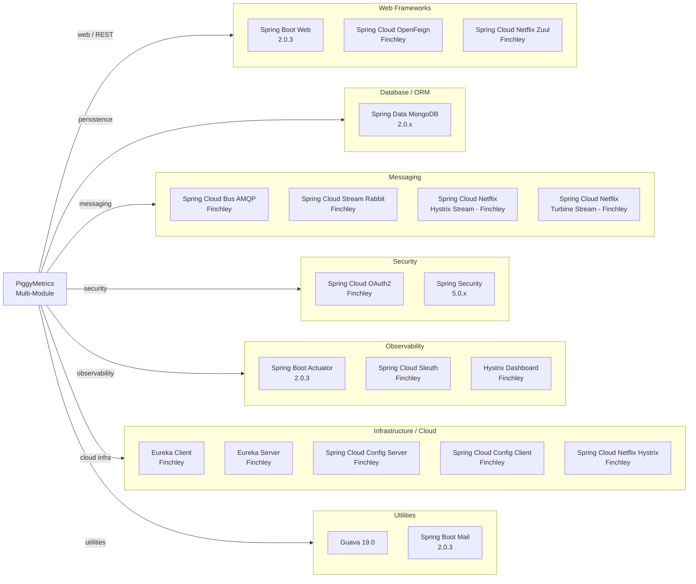

# Dependency Map

PiggyMetrics is a Spring Cloud microservices application (Java 8, Spring Boot 2.0.3, Spring Cloud Finchley.RELEASE) comprising 9 modules with a total of approximately 25 unique external production dependencies shared across all modules.

## Dependencies

### Dependency Summary

| Category | Count | Key Libraries | Notes |
|---|---|---|---|
| Web Frameworks | 3 | Spring Boot Web 2.0.3, Spring Cloud OpenFeign Finchley, Netflix Zuul Finchley | Zuul 1.x is in maintenance mode; Zuul 2 or Spring Cloud Gateway preferred |
| Database / ORM | 1 | Spring Data MongoDB 2.0.x | Each service has its own MongoDB instance |
| Messaging | 4 | Spring Cloud Bus AMQP, Spring Cloud Stream Rabbit, Hystrix Stream, Turbine Stream | All Finchley-vintage; Spring Cloud Bus used for config refresh |
| Security | 2 | Spring Cloud OAuth2 Finchley, Spring Security 5.0.x | Spring Cloud OAuth2 Finchley is deprecated; migrate to Spring Authorization Server |
| Observability | 3 | Spring Boot Actuator 2.0.3, Spring Cloud Sleuth Finchley, Hystrix Dashboard | Hystrix is now in maintenance mode; Micrometer/OTel preferred |
| Infrastructure | 5 | Eureka Client/Server, Config Server/Client, Netflix Hystrix | Netflix OSS stack (Finchley) is largely deprecated |
| Utilities | 2 | Guava 19.0, Spring Boot Mail 2.0.3 | Guava 19.0 is very old (2016); current is 33.x |

### Version & Compatibility Risks

Spring Boot 2.0.3.RELEASE and Spring Cloud Finchley.RELEASE are both end-of-life. Spring Boot 2.0.x reached end of support in 2019 and Spring Cloud Finchley in 2020. The entire Netflix OSS stack (Eureka, Hystrix, Zuul, Ribbon, Turbine) has been placed in maintenance mode by Netflix and is deprecated in modern Spring Cloud releases — Zuul 1.x should be replaced with Spring Cloud Gateway, Hystrix with Resilience4j, and the Spring Cloud Netflix Eureka client remains supported but the associated streaming/turbine infrastructure does not. `spring-cloud-starter-oauth2` (Finchley) is replaced by `spring-security-oauth2-authorization-server` and Spring Security 6.x. Guava 19.0 (released 2016) is significantly outdated and has known security advisories in some transitive paths.

### Notable Observations

- **Full Netflix OSS stack adoption**: The application uses Zuul, Hystrix, Ribbon, Eureka, and Turbine — all of which are in maintenance mode and not supported in Spring Cloud 2022.x+. A migration to Spring Cloud Gateway, Resilience4j, and Spring Boot 3.x would require replacing every Netflix component.
- **Spring Boot 2.0.3 is critically outdated**: This version predates many security patches. The current LTS is Spring Boot 3.3.x (requiring Java 17+). The Java 8 baseline further limits upgrade options.
- **Spring Cloud OAuth2 (Finchley) deprecated**: The `spring-cloud-starter-oauth2` artifact has been removed from modern Spring Cloud releases; migration to Spring Authorization Server 1.x and Spring Security 6.x is required.
- **No caching library**: There is no Redis, EhCache, or Caffeine dependency declared. The exchange rates service uses Guava for in-memory caching (application-level), which is not suitable for distributed deployments.

## Test Dependencies

| Framework | Version | Scope | Notes |
|---|---|---|---|
| Spring Boot Test | 2.0.3 | test | All services; includes JUnit 4, Mockito, AssertJ |
| de.flapdoodle.embed.mongo | 1.50.3 | test | Embedded MongoDB for integration tests |
| json-path (Jayway) | 2.2.0 | test | JSON assertions in MockMvc tests |

Total test-scope dependencies: 3 unique artifacts (used across multiple modules)

Test infrastructure is minimal: services rely on embedded MongoDB (`de.flapdoodle.embed.mongo`) for repository-layer testing and `spring-boot-starter-test` (which bundles JUnit 4, Mockito, and AssertJ) for unit and slice tests. There are no contract-testing libraries (e.g., Spring Cloud Contract, Pact), no testcontainers, and no dedicated integration test framework — this limits test coverage of inter-service communication and end-to-end flows.
