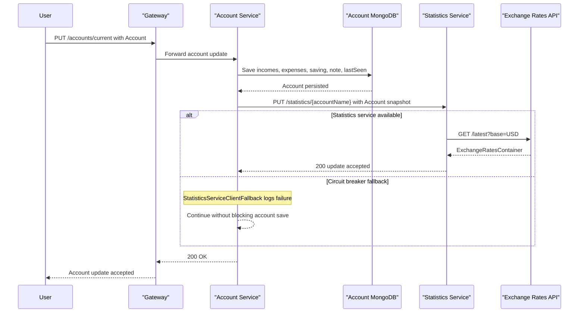

# API & Service Communication Contracts

PiggyMetrics exposes a small REST surface through a Zuul gateway and four backend service APIs. Communication is primarily synchronous HTTP, with RabbitMQ used only for bus and metric streaming rather than domain events.

## Service Catalog

| Service | Port | Category | Purpose |
| --- | --- | --- | --- |
| gateway | 4000 | API Layer | Serves the browser UI and routes public API traffic to backend services |
| auth-service | 5000 | Business | Issues OAuth2 tokens and exposes current-user and user-provisioning endpoints |
| account-service | 6000 | Business | Owns account profiles, savings, incomes, expenses, and account updates |
| statistics-service | 7000 | Business | Builds normalized daily datapoints and serves account statistics |
| notification-service | 8000 | Business | Stores notification preferences and runs backup and reminder delivery |
| config | 8888 | Infrastructure | Provides centralized shared configuration to all Spring services |
| registry | 8761 | Infrastructure | Acts as the Eureka service registry |
| monitoring | 8080 internal, 9000 exposed | Observability | Hosts the Hystrix dashboard UI |
| turbine-stream-service | 8989 | Observability | Aggregates Hystrix metrics from RabbitMQ into a Turbine stream |

## API Endpoints Inventory

| Service | Method | Path | Request Type | Response Type |
| --- | --- | --- | --- | --- |
| auth-service | GET | /uaa/users/current | Principal from OAuth2 context | Principal, 200 |
| auth-service | POST | /uaa/users | JSON `User` body | Empty body, 200 |
| account-service | GET | /accounts/{name} | Path parameter `name` | `Account`, 200 |
| account-service | GET | /accounts/current | Authenticated principal | `Account`, 200 |
| account-service | PUT | /accounts/current | JSON `Account` body | Empty body, 200 |
| account-service | POST | /accounts/ | JSON `User` body | `Account`, 200 |
| statistics-service | GET | /statistics/current | Authenticated principal | `List<DataPoint>`, 200 |
| statistics-service | GET | /statistics/{accountName} | Path parameter `accountName` | `List<DataPoint>`, 200 |
| statistics-service | PUT | /statistics/{accountName} | Path parameter plus JSON `statistics.domain.Account` body | Empty body, 200 |
| notification-service | GET | /notifications/recipients/current | Authenticated principal | `Recipient`, 200 |
| notification-service | PUT | /notifications/recipients/current | JSON `Recipient` body | `Recipient`, 200 |

## Management & Observability Endpoints

| Service | Endpoint | Custom Metrics (if any) |
| --- | --- | --- |
| registry | http://localhost:8761 | Eureka dashboard, no custom metric names declared in code |
| monitoring | http://localhost:9000/hystrix | Hystrix dashboard UI, fed by Turbine stream |
| turbine-stream-service | /turbine/turbine.stream | Aggregated Hystrix stream for dashboard consumption |
| account-service, statistics-service, notification-service | inferred default `/actuator` endpoints | `spring-boot-starter-actuator` present, but no custom metric names declared |

## DTOs & Contracts

There are no gateway-level aggregation DTOs in this repository because the gateway forwards requests without composing downstream payloads. Service-level API contracts are built around mutable Jackson-serialized POJOs such as `User`, `account.domain.Account`, `statistics.domain.Account`, `Recipient`, and `DataPoint`, while `Principal` is returned directly for the current-user lookup in auth-service.

`User` acts as both the account creation request body and auth-service provisioning contract. `Account` is used as both the account-service response model and the statistics-service recalculation request body, but the statistics module owns its own `statistics.domain.Account` type instead of sharing the account-service class. `Recipient` serves as both request and response for notification settings, and `DataPoint` is the statistics response model. No OpenAPI, Swagger, protobuf, or GraphQL schema files are declared in the repository.

## Communication Patterns

Synchronous communication dominates the system. The browser reaches the gateway, which forwards REST requests to backend services using Zuul routes. Inside the service mesh, account-service calls auth-service to provision users and statistics-service to recalculate datapoints, while notification-service calls account-service to fetch serialized account backups. Statistics-service also makes a Feign HTTP call to an external exchange-rates API.

Asynchronous messaging is limited to infrastructure concerns: account-service, statistics-service, and notification-service depend on Spring Cloud Bus over RabbitMQ, and turbine-stream-service consumes RabbitMQ-backed metric streams. Resilience is implemented through Feign plus Hystrix fallbacks. Gateway HTTP timeouts and Ribbon timeouts are configured to 20000 ms, shared Hystrix command timeout defaults to 10000 ms, and `StatisticsServiceClientFallback` logs and drops statistics refresh failures instead of failing the account update request. Services discover each other through Eureka using logical service names, except for the gateway route to auth-service and the exchange-rates client, which both use explicit URLs. API security is enforced with Spring Security OAuth2 and `@PreAuthorize` checks on machine-to-machine endpoints, but no TLS or HTTPS configuration is declared in the repository.

The effective startup chain is config-service first, then registry, then the business services and gateway, with monitoring and Turbine depending on the same infrastructure. Availability of downstream APIs therefore depends on successful config bootstrap and later service registration.

## Service Technology Matrix

| Service | Web | Data Access | Discovery | Gateway | Actuator | Cache | Metrics |
| --- | --- | --- | --- | --- | --- | --- | --- |
| gateway | Zuul and Spring MVC | None | Eureka client | Zuul routes | No actuator dependency | None | Sleuth only |
| auth-service | Spring MVC | Spring Data MongoDB | Eureka client | No | No actuator dependency | None | Sleuth |
| account-service | Spring MVC | Spring Data MongoDB | Eureka client | No | Yes | None | Actuator, Sleuth, Hystrix stream |
| statistics-service | Spring MVC | Spring Data MongoDB | Eureka client | No | Yes | In-memory daily exchange-rate cache | Actuator, Sleuth, Hystrix stream |
| notification-service | Spring MVC | Spring Data MongoDB | Eureka client | No | Yes | None | Actuator, Sleuth, Hystrix stream |
| config | Spring Cloud Config Server | None | None | No | No | None | None |
| registry | Eureka Server | None | Server | No | No | None | None |
| monitoring | Hystrix Dashboard | None | None | No | No | None | Hystrix dashboard |
| turbine-stream-service | Stream consumer | None | Eureka client | No | No | None | Turbine stream |

## Service Communication Sequence

