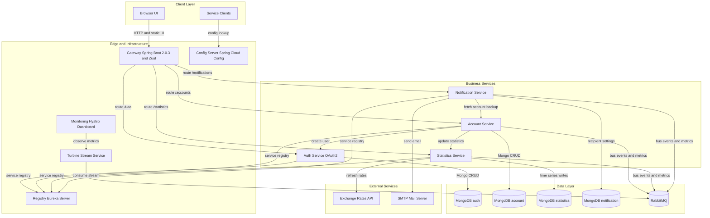
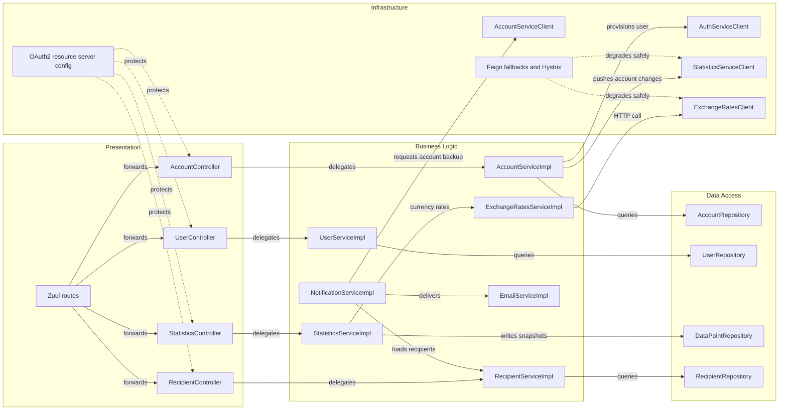

# Architecture Diagram

PiggyMetrics is a Spring Cloud microservice system built around financial account management, statistics, and notifications. The codebase separates user-facing domain services from supporting infrastructure services such as configuration, discovery, gateway routing, and monitoring.

## Application Architecture

### Technology Stack Summary

| Layer | Technology | Version | Purpose |
| --- | --- | --- | --- |
| Client | Static JavaScript served by Zuul gateway | N/A | Browser-based budget UI |
| Edge | Spring Boot gateway with Netflix Zuul | Spring Boot 2.0.3, Spring Cloud Finchley | Single entry point and route forwarding |
| Business | Spring Boot REST services | Spring Boot 2.0.3 | Account, auth, statistics, and notification logic |
| Integration | Spring Cloud Config, Eureka, OpenFeign, Hystrix, Sleuth | Finchley managed by BOM | Central config, discovery, service calls, tracing, resilience |
| Data | Spring Data MongoDB plus dedicated MongoDB per service | MongoDB image 3 | Document persistence per bounded context |
| Messaging and Observability | RabbitMQ, Hystrix Dashboard, Turbine Stream | RabbitMQ 3-management | Config bus and Hystrix stream aggregation |
| External | Exchange rates HTTP API and SMTP mail server | External SaaS | Currency normalization and outbound email delivery |

### Data Storage & External Services

Each business service persists to its own MongoDB database instance, preserving service ownership boundaries while avoiding direct cross-service database access. RabbitMQ is used for Spring Cloud Bus and Turbine stream collection, while statistics-service depends on an external exchange-rate HTTP API and notification-service depends on SMTP for outbound mail delivery.

### Key Architectural Decisions

- Uses database-per-service boundaries for the four business microservices, with cross-service data shared only through REST contracts.
- Centralizes runtime configuration in config-service and service lookup in Eureka, so clients depend on logical service names instead of fixed endpoints.
- Places gateway routing, monitoring, and metric aggregation in separate infrastructure modules rather than embedding those concerns into business services.

## Component Relationships

### Component Inventory

| Component | Layer | Type | Responsibility |
| --- | --- | --- | --- |
| GatewayApplication and Zuul routes | Presentation | API gateway | Serves static UI and forwards `/uaa`, `/accounts`, `/statistics`, and `/notifications` traffic |
| AccountController | Presentation | REST controller | Reads and updates account state for the current user or named account |
| UserController | Presentation | REST controller | Exposes current principal lookup and user provisioning API |
| StatisticsController | Presentation | REST controller | Returns daily statistics snapshots and accepts recalculation requests |
| RecipientController | Presentation | REST controller | Reads and saves notification settings for the current user |
| AccountServiceImpl | Business Logic | Service | Creates accounts, persists updates, and triggers downstream statistics refresh |
| UserServiceImpl | Business Logic | Service | Creates auth-service users and supports token-backed user lookup |
| StatisticsServiceImpl | Business Logic | Service | Normalizes account data into time-series datapoints |
| ExchangeRatesServiceImpl | Business Logic | Service | Caches daily exchange-rate lookups and currency conversions |
| RecipientServiceImpl | Business Logic | Service | Persists recipient settings and determines who is ready to notify |
| NotificationServiceImpl | Business Logic | Scheduled service | Runs reminder and backup workflows |
| EmailServiceImpl | Business Logic | Integration service | Builds and sends reminder or backup emails |
| AccountRepository, UserRepository, DataPointRepository, RecipientRepository | Data Access | Spring Data repositories | Persist service-owned MongoDB documents |
| AuthServiceClient, StatisticsServiceClient, AccountServiceClient, ExchangeRatesClient | Infrastructure | Feign clients | Implement synchronous service-to-service and external HTTP communication |
| ResourceServerConfig and Feign fallbacks | Infrastructure | Security and resilience | Enforce OAuth2 resource protection and graceful degradation |
