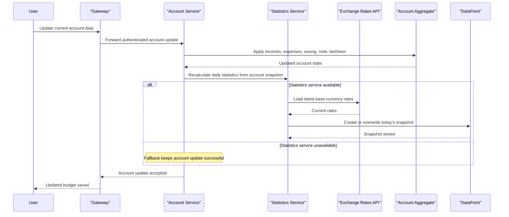

# Core Business Workflows

PiggyMetrics helps users track account balances, incomes, expenses, savings, and reminder preferences. Its core workflows revolve around account onboarding, budget updates that drive derived statistics, and scheduled notifications that send reminders or account backups.

## Domain Entities

| Entity | Service / Bounded Context | Description | Key Relationships |
| --- | --- | --- | --- |
| User | auth-service / Identity | Represents an authenticated principal used for OAuth2-backed access | Provisioned before a new account can be created |
| Account | account-service / Budget Management | Canonical user budget profile containing incomes, expenses, savings, and notes | Feeds statistics snapshots and is the source of backup content |
| DataPoint | statistics-service / Analytics | Daily normalized snapshot of account financial state | Derived from Account updates and grouped by account and day |
| Recipient | notification-service / Communications | Notification preferences for a specific account | References account ownership and embeds per-notification schedules |
| NotificationSettings | notification-service / Communications | Per-type schedule and last-notified metadata | Determines reminder and backup eligibility |
| Saving and Item | account-service / Budget Management | Value objects describing savings plan and recurring financial entries | Embedded within Account and normalized by statistics-service |

## Service-to-Domain Mapping

| Service | Domain Context | Owned Entities | External Dependencies |
| --- | --- | --- | --- |
| auth-service | Identity and access | User | Config-service, Eureka |
| account-service | Budget management | Account, Saving, Item | auth-service, statistics-service, config-service, Eureka |
| statistics-service | Financial analytics | DataPoint, ItemMetric, derived Account snapshot | Exchange-rates API, config-service, Eureka |
| notification-service | User communications | Recipient, NotificationSettings | account-service, SMTP server, config-service, Eureka |
| gateway | Experience routing | None | auth-service, account-service, statistics-service, notification-service |
| config, registry, monitoring, turbine-stream-service | Platform support | None | RabbitMQ and service infrastructure |

## Primary Workflows

### Workflow 1: Register a new account

A new user submits account creation data to `POST /accounts/`. Account-service first checks whether the requested username already exists, then calls auth-service to create the backing `User` principal. After identity provisioning succeeds, account-service initializes a default `Saving` object, stamps `lastSeen`, saves the new `Account`, and returns the created account profile.

Business rules involved:
- Account names must be unique within account-service.
- A matching auth-service user must exist before the account is considered valid.
- New accounts always start with a zeroed saving configuration and current `lastSeen` timestamp.

### Workflow 2: Update account data and refresh statistics

An authenticated user sends `PUT /accounts/current` through the gateway. Account-service loads the current account, replaces incomes, expenses, saving, and note values, updates the `lastSeen` timestamp, and saves the new aggregate. It then invokes statistics-service so that a daily `DataPoint` snapshot is recalculated from the new account state and current exchange rates.

Business rules involved:
- The target account must already exist.
- Statistics are normalized to a base currency and base time period before snapshot storage.
- If statistics refresh fails, the account update still succeeds and the analytics refresh is deferred by fallback behavior.

### Workflow 3: Run reminder and backup notifications

Notification-service runs two scheduled jobs: one for reminders and one for backups. Each job queries `RecipientRepository` for recipients whose notification type is active and overdue based on `lastNotified` plus configured frequency. Reminder notifications send only a message, while backup notifications first request the serialized account payload from account-service and attach it to the email before marking the recipient as notified.

Business rules involved:
- A notification type must be enabled and overdue before a recipient is eligible.
- `lastNotified` is initialized when settings are first saved so scheduling has a baseline.
- Failed sends do not stop the batch; the service logs the error and continues processing other recipients asynchronously.

## Cross-Service Data Flows

The most important cross-service flow is account mutation followed by analytics refresh: account-service is the source of truth for editable financial data, statistics-service consumes a snapshot copy to produce daily read models, and exchange-rates data is joined during that calculation. A second cross-service flow powers backup notifications, where notification-service fetches account data from account-service and combines it with recipient settings before sending email.

Fallback behavior is business-relevant in the account update flow. When statistics-service is unavailable, account-service uses a Hystrix fallback that logs the failure and preserves the user-visible account update, meaning users can keep editing budgets even if their analytics view lags behind.

## Business Workflow Sequence

## Business Rules & Decision Logic

- **Validation rules**: account and recipient payloads use bean validation, including required saving structures, email formatting, and note length limits; invalid requests fail before persistence.
- **Uniqueness and existence**: account creation rejects duplicate usernames, while update flows require an existing account before changes are saved.
- **Derived-value logic**: statistics-service converts all financial items to a base currency and base period before computing income, expense, and saving totals for each day.
- **Scheduling logic**: notification eligibility is decided by notification type, active flag, configured frequency, and `lastNotified` timestamp.
- **Authorization rules**: user-facing current-account and current-recipient operations depend on authenticated principals, and machine-to-machine endpoints are guarded with OAuth2 scope checks such as `server`.
- **Error handling and consistency**: account persistence completes before downstream statistics refresh, creating eventual consistency between account-service and statistics-service when the fallback path is used.
