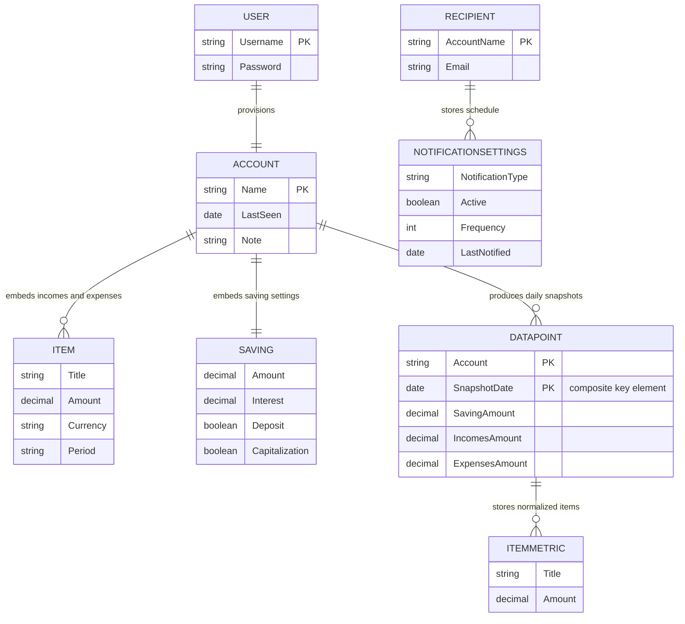

# Data Architecture & Persistence Layer

PiggyMetrics uses a document-oriented persistence layer with four service-owned MongoDB databases and a small number of core aggregate documents. Persistence is implemented with Spring Data MongoDB repositories and a single in-memory cache for daily exchange-rate data.

## Database Configuration

| Service/Module | DB Type | Profile | Driver | Connection | Migration Tool |
| --- | --- | --- | --- | --- | --- |
| auth-service | MongoDB | default shared config | Spring Data MongoDB managed by Spring Boot | Host `auth-mongodb`, database `piggymetrics`, port `27017` | None declared |
| account-service | MongoDB | default shared config | Spring Data MongoDB managed by Spring Boot | Host `account-mongodb`, database `piggymetrics`, port `27017` | None declared |
| statistics-service | MongoDB | default shared config | Spring Data MongoDB managed by Spring Boot | Host `statistics-mongodb`, database `piggymetrics`, port `27017` | None declared |
| notification-service | MongoDB | default shared config | Spring Data MongoDB managed by Spring Boot | Host `notification-mongodb`, database `piggymetrics`, port `27017` | None declared |
| config-service | None | `native` Spring profile | N/A | Reads YAML from bundled classpath shared directory | N/A |

Seed data is provided only for local container startup through the reusable `mongodb` image and the optional `INIT_DUMP` environment variable used by `account-mongodb`. No Flyway, Liquibase, or schema migration tool is declared anywhere in the repository.

## Data Ownership per Service

| Service | Tables Owned | ORM Framework | Caching | Notes |
| --- | --- | --- | --- | --- |
| auth-service | `users` | Spring Data MongoDB | None | Source of truth for credentials and principals |
| account-service | `accounts` | Spring Data MongoDB | None | Stores user-facing budget profile and savings state |
| statistics-service | `datapoints` and normalized account snapshot input model | Spring Data MongoDB | In-memory daily exchange-rate container | Persists derived time-series data rather than the full editable account document |
| notification-service | `recipients` | Spring Data MongoDB | None | Stores email target and per-notification scheduling preferences |
| gateway, config, registry, monitoring, turbine-stream-service | None | N/A | None | Stateless infrastructure services |

## Entity Model

## Key Repository Methods

| Service | Repository | Notable Methods | Purpose |
| --- | --- | --- | --- |
| account-service | `AccountRepository` | `findByName(String name)` | Fetches the account aggregate by its natural key before reads, updates, and duplicate checks |
| auth-service | `UserRepository` | Inherited `CrudRepository` methods only | Stores and loads users by username for authentication |
| statistics-service | `DataPointRepository` | `findByIdAccount(String account)` | Returns all stored datapoints for an account to power trend views |
| notification-service | `RecipientRepository` | `findByAccountName(String name)`, `findReadyForBackup()`, `findReadyForRemind()` | Reads current preferences and uses custom Mongo queries to find recipients whose scheduled notifications are due |

## Caching Strategy

| Service | Cache Layer | Provider | Pattern | Notes |
| --- | --- | --- | --- | --- |
| statistics-service | Exchange rate cache | In-process Java field on `ExchangeRatesServiceImpl` | Lazy refresh, cache until date changes | Reuses one fetched rate container for the current day to avoid repeated external API calls |
| All other services | None detected | N/A | N/A | No Spring Cache, Redis, or second-level cache configuration is declared |

## Data Ownership Boundaries

PiggyMetrics follows a database-per-service topology for its business services. Auth, account, statistics, and notification each own separate MongoDB instances and repositories, and no module reads another service's database directly. Cross-service access happens through REST APIs only: account-service provisions users through auth-service and pushes account snapshots to statistics-service, while notification-service fetches account backups over HTTP instead of joining data at the persistence layer.

Write traffic is isolated to the owning service, while statistics-service maintains a derived read model of historical datapoints built from account updates. There is no formal CQRS framework, but the separation between editable account documents and generated statistics snapshots creates a lightweight derived-data pattern.

### Data Classification & Sensitivity

| Entity | Sensitive Fields | Classification (PII/PHI/PCI/None) | Controls in Place |
| --- | --- | --- | --- |
| `User` | `username`, `password` | PII plus credentials | Stored in MongoDB; no encryption-at-rest, hashing details, or masking rules are declared in repository configuration |
| `Account` | `name`, `note`, financial income and expense entries | PII and confidential financial profile data | OAuth2 protects API access, but no field-level masking or encryption configuration is declared |
| `Recipient` | `accountName`, `email` | PII | OAuth2 protects the API; no masking or encryption settings are declared |
| `DataPoint` | `account`, normalized income and expense metrics | Confidential financial analytics | Stored as service-owned derived data; no additional controls declared |
| `NotificationSettings` | frequency and last-notified timestamps | Internal operational data | No special controls declared |
