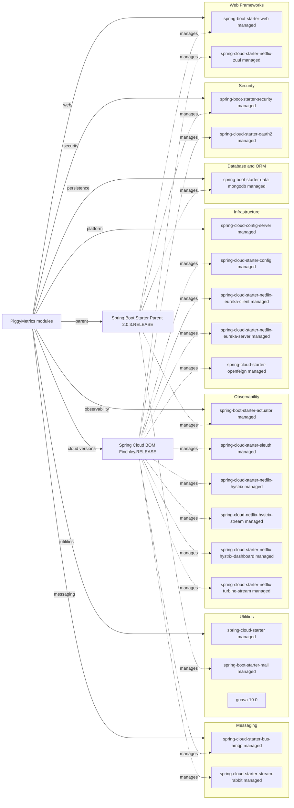

# Dependency Map

PiggyMetrics is a multi-module Maven build with about 20 distinct production dependencies declared across its modules, plus three recurring test-only libraries. Most versions are managed centrally by the Spring Boot 2.0.3 parent and the Spring Cloud Finchley BOM.

## Dependencies

### Dependency Summary

| Category | Count | Key Libraries | Notes |
| --- | --- | --- | --- |
| Web Frameworks | 2 | spring-boot-starter-web, spring-cloud-starter-netflix-zuul | REST services plus gateway routing |
| Database / ORM | 1 | spring-boot-starter-data-mongodb | All business services persist documents with Spring Data MongoDB |
| Messaging | 2 | spring-cloud-starter-bus-amqp, spring-cloud-starter-stream-rabbit | RabbitMQ-backed config bus and Turbine stream |
| Security | 2 | spring-boot-starter-security, spring-cloud-starter-oauth2 | OAuth2 auth server and resource server protection |
| Observability | 6 | actuator, sleuth, hystrix, hystrix-stream, hystrix-dashboard, turbine-stream | Tracing, health endpoints, circuit breakers, dashboards |
| Infrastructure | 5 | config-server, config-client, eureka-client, eureka-server, openfeign | Central config, discovery, and inter-service HTTP clients |
| Utilities | 3 | spring-cloud-starter, starter-mail, guava 19.0 | Gateway base support, email delivery, immutable collections |

### Version & Compatibility Risks

The dependency stack is anchored on Spring Boot 2.0.3.RELEASE, Spring Cloud Finchley.RELEASE, Java 8, Netflix Zuul 1, and Hystrix-era components. Those versions are long out of mainstream support, and both Zuul 1 and Hystrix are retired technologies, which raises migration and compatibility concerns for modern JDKs and cloud platforms.

### Notable Observations

- Most production dependency versions are inherited rather than pinned in module POMs, so the root parent and BOM drive compatibility across the entire solution.
- The statistics-service adds Guava 19.0 explicitly, which is older than the rest of the managed platform and may require attention during upgrades.
- Observability and resilience are heavily coupled to the Netflix OSS stack rather than newer Spring Cloud LoadBalancer and Resilience4j components.
- Notification, account, and statistics services all repeat the same cloud client stack, indicating a uniform but tightly shared service template.

## Test Dependencies

| Framework | Version | Notes |
| --- | --- | --- |
| spring-boot-starter-test | managed by Spring Boot 2.0.3 | Common test harness across all service modules |
| de.flapdoodle.embed.mongo | 1.50.3 | Embedded MongoDB for repository and controller tests |
| json-path | 2.2.0 | JSON assertions in controller tests |

Total test-scope dependencies: 3

The test stack is simple and service-oriented, but it is also dated and tied to the older Spring Boot 2 test platform. No contract-testing or container-based integration testing libraries are declared.
